# OCR on Golf Score Cards

Author: Xin Ying Leong (https://www.linkedin.com/in/blxy)

This project builds a specialized OCR pipeline to extract handwritten scores from a single snapshot for subsequent score digitalization.
Golf scores often include messy handwritting, superscripts and shapes, making it a challenge for the recognition of the main digit.
The pipeline includes the following stages:

> Image Registration onto a template
- Image registration with SIFT + orientation invariance on a defined template with hand-picked defined cropping points, which are used to crop score cells. A double homography is used to match the left page and the right page separately, avoiding the crease of the card. Some parts of the registered image are masked for privacy reasons.

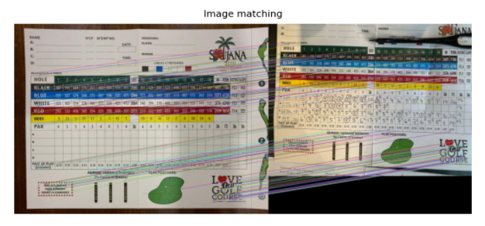
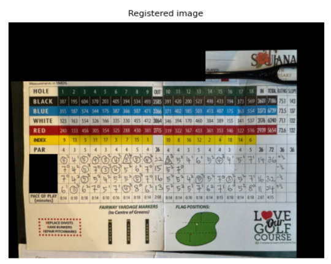

- Older version: Image registration with ORB on a defined template with hand-picked defined cropping points, which are used to crop score cells. A double homography is used to match the left page and the right page separately, avoiding the crease of the card. Some parts of the registered image are masked for privacy reasons.

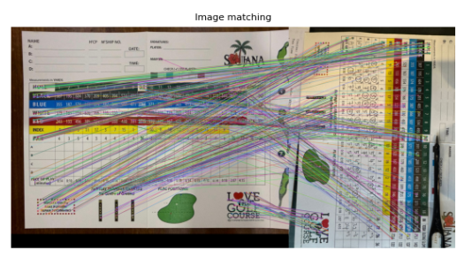
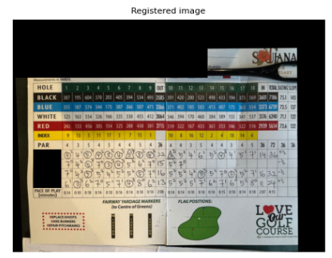

> Single-cell Recognition

- Score cells are passed through a Fine-tuned Resnet-18 for classification, classes include digits 1-9 and the blank cell (`-`). Confidence scores are returned with the prediction for threshold-based decision making. (0 errors)

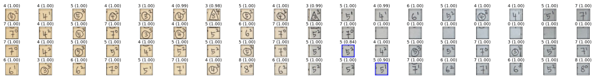

- Older version: Score cells are passed through a Convolutional Neural Network (CNN) for classification, classes include digits 1-9 and the blank cell (`-`). Confidence scores are returned with the prediction for threshold-based decision making. (7 errors)

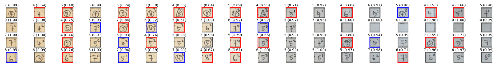

---

Simple tools are also created to faciliate hand-picking points for a given template [manual_pointing.py](scripts/tools/manual_pointing.py), and to annotate cells prior to CNN training [cell_labeller.py](scripts/tools/cell_labeller.py)

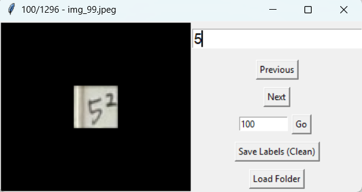
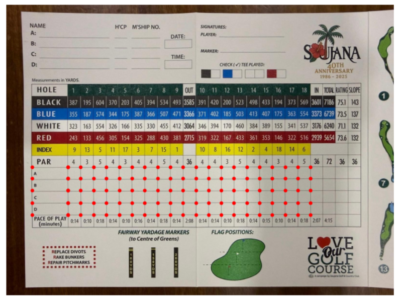

---

The most recent pipeline and API has been generalized, which also works on a different template type:
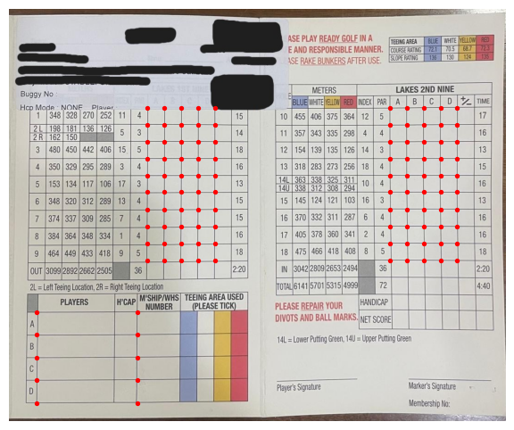

- Example 1
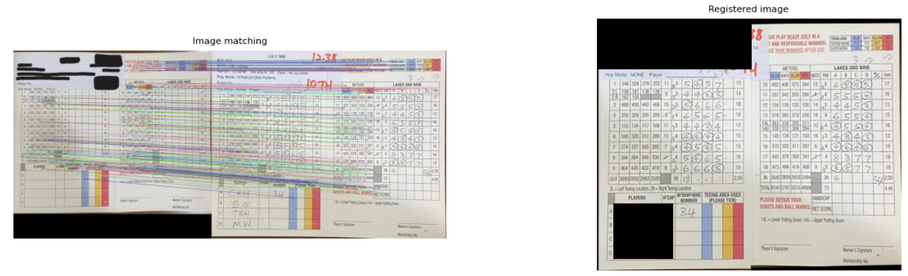
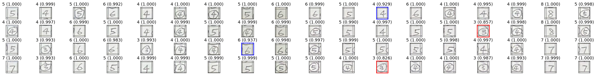
- Example 2
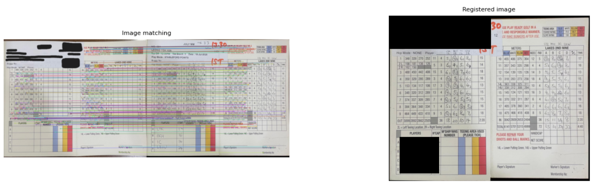
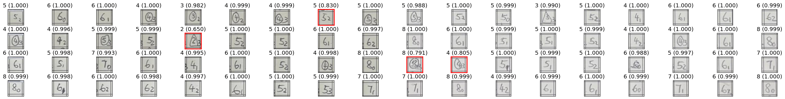